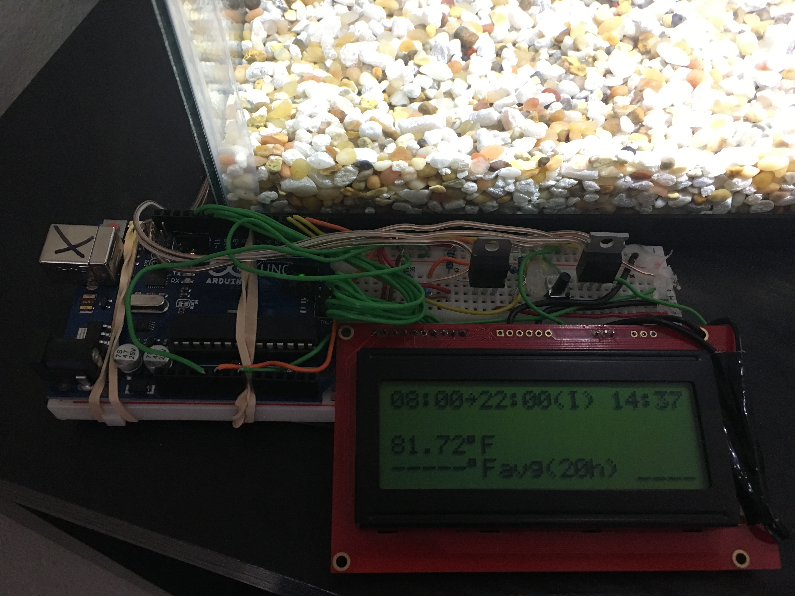
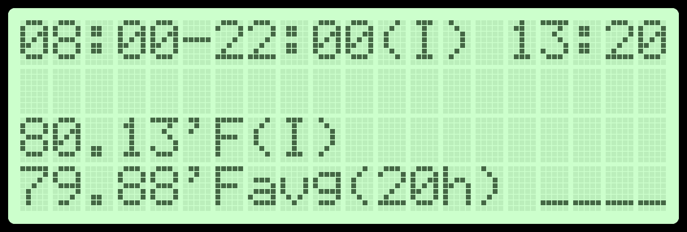

# Guppy (Arduino Controlled Fish Tank)
Arduino codebase for an embedded system that monitors and controls temperature and light levels in a 5 gallon fish tank.

## LCD Display

In the below image we had to select ' instead of the deg symbol and - instead of an arrow symbol. There are other simulation visual failings such as the lack of a graph due to limiations of the simulator but nonetheless gives a good feeling for what is displayed on the LCD at runtime.

